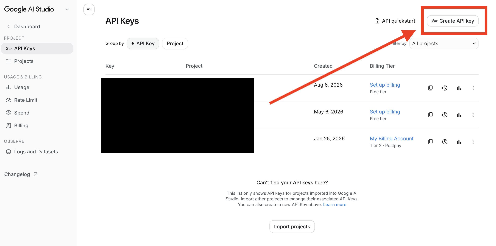
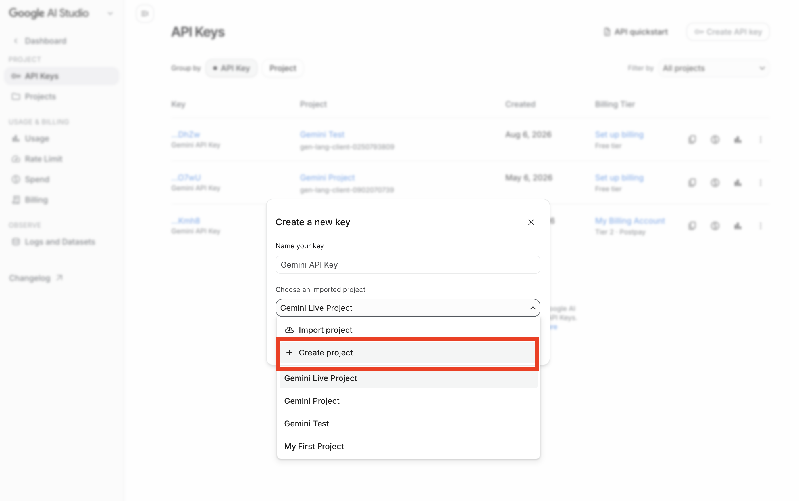
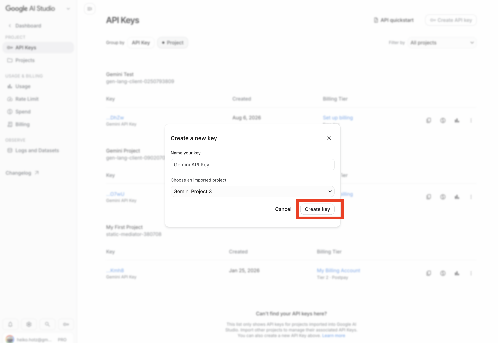
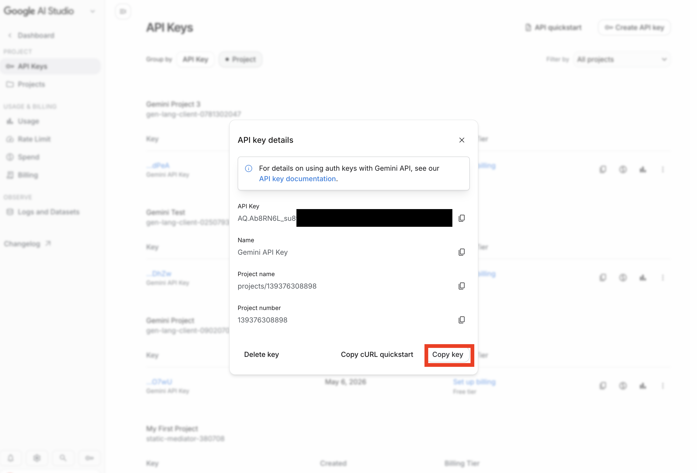

# AI Agent Workshop 🚀

Welcome to the **AI Agent Workshop**. In this hands-on course, you will learn how to architect, build, and deploy production-grade AI Agents using the **Google Agent Development Kit (ADK)** and **Gemini** models.

## Project Overview

You will build a **Autonomous Financial Research Team** designed for enterprise use. This system evolves from a simple script into a sophisticated, multi-agent organization capable of complex financial reasoning, deep research, and executive reporting.

## The Agent Evolution

The workshop follows a progressive "Crawl, Walk, Run" methodology, where you build layers of capability module by module:

### Phase 1: The Specialist (Module 1 & 2)
You start by building individual experts:
*   **The Quant**: connected to live market data tools to fetch stock prices and perform financial math.
*   **The Analyst**: grounded in internal knowledge (Investment Policies, Strategy Papers) using Retrieval-Augmented Generation (RAG).

### Phase 2: The Manager (Module 3)
You introduce hierarchy:
*   **The Manager**: A routing agent that understands user intent and delegates tasks to the appropriate specialist, synthesizing their outputs into a coherent answer.

### Phase 3: The Organization (Module 4)
You implement complex orchestration:
*   **The Autonomous Team**: A full research department that can take a high-level goal (e.g., "Analyze our AI strategy"), break it down, perform iterative research loops with self-correction and compliance checks, and produce a polished executive memo.

## Workshop Structure

| Module | Topic | Key Concepts |
| :--- | :--- | :--- |
| **[Module 1](module_01/)** | **The Zero-to-One Agent** | Tools, Function Calling, Basic Reasoning |
| **[Module 2](module_02/)** | **RAG-Powered Agents** | Vector Ops, Embedding, Grounding, MCP |
| **[Module 3](module_03/)** | **Workflow Agents** | Hierarchical Delegation, Routing, State |
| **[Module 4](module_04/)** | **Complex Multi-Agent Systems** | Sequential & Loop Flows, Custom Logic, Self-Correction |

## Getting Started

### 1. Prerequisites
-   Python 3.10+
-   A free Google AI Studio API key (instructions below)

### 2. Get a free Gemini API key

1. Open the [Google AI Studio API Keys page](https://aistudio.google.com/app/api-keys), sign in, and click **Create API key**.

   

2. In the project selector, choose **Create project** if you do not already have
   a suitable Google Cloud project.

   

3. Select a project without billing enabled for free-tier use, then click
   **Create key**.

   

4. Click **Copy key**. Create a `.env.local` file in the repository root and
   save the key there:

   

   ```bash
   GOOGLE_API_KEY=your_api_key_here
   ```

The API key itself is free, and Gemini 3.5 Flash-Lite currently offers free-tier input and output subject to project-specific limits. Check **Rate Limit** in AI Studio for the limits that apply to your project. Free-tier prompts may be used to improve Google's products, so use only the simulated workshop documents—not confidential or customer data. Never commit `.env.local` or share your API key.

### 3. Environment Setup
1.  **Clone the repository**:
    ```bash
    git clone https://github.com/heiko-hotz/financial-assistant-adk-workshop.git
    cd financial-assistant-adk-workshop
    ```

2.  **Create a virtual environment**:
    ```bash
    python3 -m venv .venv
    source .venv/bin/activate
    ```

3.  **Install dependencies**:
    ```bash
    pip install 'google-adk[mcp]' google-genai python-dotenv chromadb uv jupyter
    ```

### 4. Running the Workshop
Each module contains a Jupyter Notebook (`.ipynb`) for learning and a Python folder (e.g., `financial_agent_app/`) for the production-ready code.

Start with Module 1:
```bash
jupyter notebook module_01/01_fast_track_agent.ipynb
```

### Free-tier rate limits

Gemini limits are applied per project and can vary. Check the active limits for
your project on the [AI Studio Rate Limit dashboard](https://aistudio.google.com/rate-limit)
before running several agents back-to-back. As of **6 August 2026**, the free
test project used to validate this workshop showed limits of **15 requests per
minute (RPM)**, **250,000 input tokens per minute (TPM)**, and **500 requests per
day (RPD)** for Gemini 3.5 Flash-Lite. Treat these as a dated reference rather
than guaranteed limits for your project.

The later modules make multiple model requests for planning, retrieval, review,
and reporting, so rapidly executing every notebook and smoke script can exhaust
a free project's requests-per-minute allowance even though each module works on
its own.

If you receive `429 RESOURCE_EXHAUSTED`, wait for the retry interval shown in
the error (or until the minute window clears), then rerun that module. This is a
temporary quota limit, not evidence that the API key is invalid. See Google's
[Gemini API rate-limit guide](https://ai.google.dev/gemini-api/docs/rate-limits)
for the current rules.

## Technologies Used
-   **Google ADK**: Framework for agent construction, orchestration, and evaluation.
-   **Gemini 3.5 Flash-Lite**: Fast, cost-effective LLM for high-throughput agent tasks.
-   **ChromaDB**: Open-source embedding database for RAG.
-   **Model Context Protocol (MCP)**: Standard interface for connecting AI models to data.
