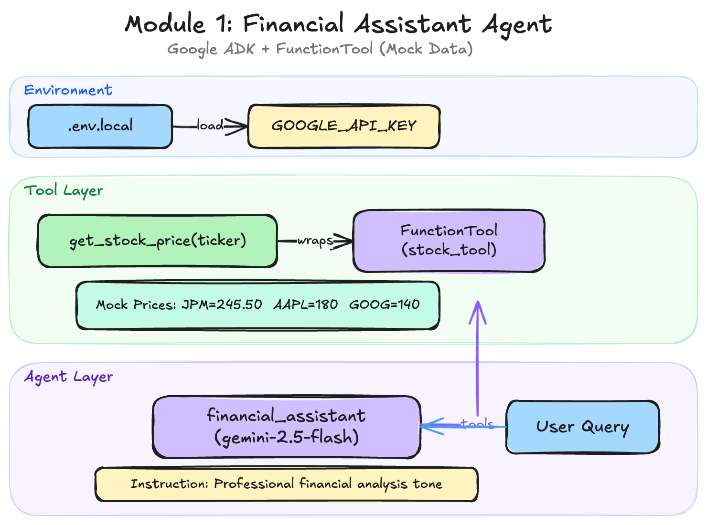

# Module 1: The Zero-to-One Agent 🚀

In this module, you will build your very first **AI Agent** using the Google Agent Development Kit (ADK).

## Learning Objectives
- Understand the core components of an AI Agent (Reasoning, Acting, Reflecting).
- Use the `google-adk` and `google-genai` libraries.
- Create and integrate a custom **Tool** (Python function) for fetching stock prices.
- Run an interactive chat session with your agent.

## Key Files
- `01_fast_track_agent.ipynb`: The main workshop notebook.
- `adk-workshop-module1.png`: Architecture diagram for the agent.
- `financial_agent_app/`: Production-ready version of the agent logic.

## Getting Started
Open the notebook [01_fast_track_agent.ipynb](01_fast_track_agent.ipynb) and follow the step-by-step instructions.
