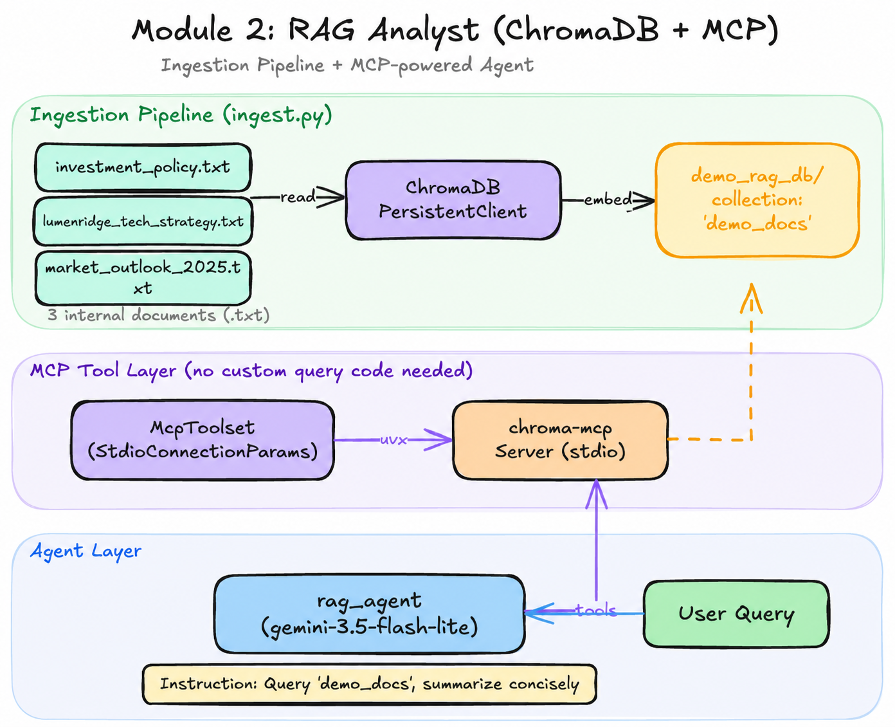

# Module 2: RAG-Powered Agents 📚

Learn how to connect your agents to external knowledge using **Retrieval-Augmented Generation (RAG)**.

## What does this Agent do?

In this module, you build a **Knowledge-Grounded Financial Agent** that can "read" and reason over private corporate data.

- **Grounded reasoning**: Unlike vanilla LLMs that may hallucinate unknown facts, this agent uses a **Vector Database (Chroma)** to retrieve specific excerpts from Lumenridge Financial Group investment policies and market outlooks before answering.
- **Policy-Aware Analysis**: The agent is trained to prioritize internal strategy documents, ensuring that its financial advice is not just generic but aligned with the firm's specific guidelines and current 2025 outlook.
- **Dynamic Ingestion**: You will learn how to build an ingestion pipeline (`ingest.py`) that transforms raw text files into searchable mathematical embeddings. Each run rebuilds the demo collection from the current files, so renamed or removed documents do not remain searchable.

## Learning Objectives
- Understand the RAG pipeline (Ingestion, Retrieval, Generation).
- Work with vector databases (Chroma).
- Query internal documents like investment policies and market outlooks.
- Enhance agent responses with grounded facts.

## Key Files
- `02_rag_agent.ipynb`: The main workshop notebook for RAG.
- `ingest.py`: Script to process and load documents into the vector database.
- `investment_policy.txt`, `lumenridge_tech_strategy.txt`, `market_outlook_2025.txt`: Sample knowledge base documents.
- `rag_agent/`: Production-ready agent implementation with RAG.

## Getting Started
Begin by reviewing the documents and then open [02_rag_agent.ipynb](02_rag_agent.ipynb).
