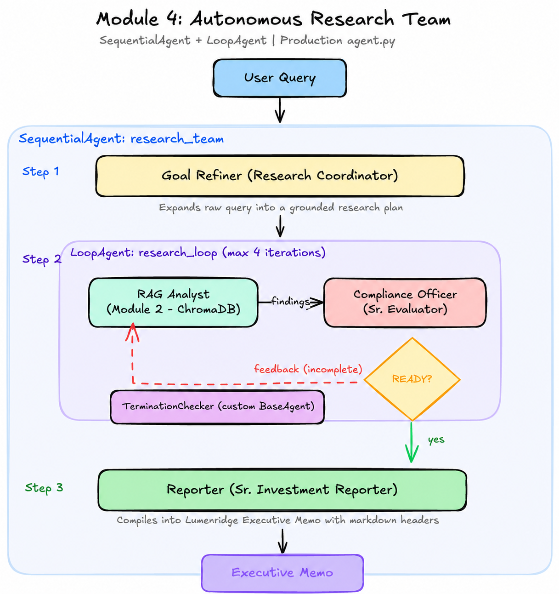

# Module 4: Complex Multi-Agent Systems 🕸️

Master the orchestration of **Complex Workflows** using specialized agents working in concert.



## Overview

In this module, you build a **Autonomous Research Team**—a production-grade system where specialized AI personas collaborate to perform deep financial research, validate findings, and generate executive-level reports.

Unlike previous modules where a single agent handled tasks, this system uses **hierarchical orchestration** to break a complex problem (creating a strategy memo) into distinct phases: **Planning**, **Execution & Validation**, and **Reporting**.

## Agent Architecture

The core agent, `research_team`, is a **Sequential Agent** that orchestrates a three-stage pipeline:


### 1. Goal Refiner (The Planner)
*   **Type**: `Agent` (Gemini 2.5 Flash)
*   **Role**: Acts as the project lead. It takes the user's high-level, potentially vague question (e.g., "AI strategy?") and expands it into a detailed, technical research prompt suitable for a specialist analyst.
*   **Goal**: Ensure the downstream agents have clear, actionable instructions.

### 2. Research Loop (The Execution Engine)
*   **Type**: `LoopAgent`
*   **Role**: Iteratively researches and reviews information to ensure quality *before* the final report is written.
*   **Components**:
    *   **RAG Analyst**: (Reused from Module 2) Uses the RAG tools to fetch real data from the JPMorgan docs.
    *   **Compliance Officer**: (The Critic) Reviews the Analyst's findings for completeness and professional tone. If the findings are insufficient, it provides feedback for the next iteration. If satisfied, it outputs `READY_FOR_SUMMARY`.
    *   **Termination Checker**: A custom `BaseAgent` that monitors the Compliance Officer. If it sees the "READY" signal, it immediately stops the loop, preventing unnecessary API calls.

### 3. Reporter (The Writer)
*   **Type**: `Agent` (Gemini 2.5 Flash)
*   **Role**: Takes the verified, raw research data and the compliance feedback to synthesize a polished **JPMorgan Executive Memo**.
*   **Output**: A professionally formatted Markdown document with headers, bullet points, and strategic insights.

## Key Concepts Demonstrated

*   **Agent Reuse**: Importing the `root_agent` from Module 2 (`rag_analyst`) to use as a sub-agent in this new system.
*   **Loop Primitives**: Using `LoopAgent` for iterative refinement and self-correction.
*   **Custom Control Logic**: Implementing `TerminationChecker` (`BaseAgent`) to programmatically control workflow state based on LLM output.
*   **Sequential Pipelines**: Chaining agents where the output of one becomes the context for the next.

## Output Example

When you run this agent, you will see a trace of the team working:

1.  **Goal Refiner**: *"I will research the specific technical pillars of..."*
2.  **RAG Analyst**: *[Simulated Tool Calls to fetch docs]*
3.  **Compliance Officer**: *"The data looks good. READY_FOR_SUMMARY."*
4.  **Reporter**:

    ```markdown
    # JPMorgan Chase & Co. Executive Memo
    **To:** Executive Leadership Team
    **Subject:** AI Infrastructure Growth Strategy
    ...
    ```

## How to Run

You can test this complex workflow using the included test script:

```bash
python module_04/test_module_4.py
```

Or explore the architecture in the notebook:
*   `04_complex_workflows.ipynb`
